 
  
# PBA Vision Mapping

## Introduction

This software is developed to work with a three-axis system equipped with an onboard camera. It requires constant error mapping due to thermal compensation or other reasons.

## :books: Documentation

The comprehensive documentation for this project is organized into several sections, covering everything from initial requirements to deployment and maintenance. For a central navigation hub to all documentation, please see:

- [**Main Documentation Hub (links.md)**](docs/links.md)

Key documentation sections include:

| Documentation Section                                          | Description                                                                                       |
|----------------------------------------------------------------|---------------------------------------------------------------------------------------------------|
| [Project Overview & Setup](docs/0_overview/README.md)          | High-level context, goals, stakeholders, and developer setup/contribution guidelines.             |
| [Requirements](docs/1_requirements/README.md)                  | Detailed functional/non-functional requirements, user stories, and backlog.                       |
| [Architecture](docs/2_architecture/README.md)                  | System architecture, components, design decisions, and technology stack.                          |
| [Design](docs/3_design/README.md)                              | UI/UX design specifications, component interactions, and visual design guidelines.                |
| [Technical Design](docs/4_technical_design/README.md)          | In-depth technical specifications, API designs, data models, and key algorithms.                  |
| [Implementation Plan](docs/5_implementation_plan/README.md)    | Phased project implementation strategy, task backlog, and dependency mapping.                     |
| [Testing](docs/6_testing/README.md)                            | Comprehensive testing strategy, test scenarios, cases, and quality assurance processes.           |
| [Infrastructure](docs/7_infrastructure/README.md)              | Deployment strategies, infrastructure requirements, and Infrastructure as Code (IaC) plans.       |
| [Context Cohesion & Changelog](docs/8_context_cohesion/README.md)| Maintaining documentation consistency, traceability, changelogs, and as-built updates.            |
| [AI Agent Blueprints](docs/9_ai_agent_blueprints/README.md)    | Guidelines and blueprints for creating and utilizing AI agents within the project.                |

---

## :hourglass_flowing_sand: Setting Up Developer Environment

For detailed instructions on setting up your development environment, including Python versioning, dependency installation, and hardware-specific configurations, please refer to our [**Contributing Guide**](docs/0_overview/CONTRIBUTING.md#setting-up-developer-environment).

This guide covers:
- Python environment creation (using Python 3.13)
- Installation of ACS SPiiPlus, FLIR PySpin, OpenCV, HALCON, and Graphviz
- Troubleshooting common issues like Qt plugin errors
- Setup for Dahua Camera and HALCON library

Once your environment is set up, if you plan to contribute to the project, please also review the [Contribution Guidelines](docs/0_overview/CONTRIBUTING.md#how-to-contribute) in the same document for information on coding standards, branch strategy, and pull request processes.

---

## Software Architecture

The software architecture for this project is detailed in the `docs/2_architecture` directory. For a high-level overview of the layered architecture, key components, and their responsibilities, please see:

- [**Software Architecture Overview**](docs/2_architecture/architecture.md)

This section includes information on the Presentation, Application, Domain, and Infrastructure layers of the system.

---

## Project Structure

```mermaid
flowchart LR
    A["<b>pba_vision_mapping/</b>"] --> B["<b>assets/</b><br/><i>Image assets, icons, etc.</i>"]
    A --> C["<b>docs/</b><br/><i>Documentation files</i>"]
    A --> D["<b>src/</b><br/><i>Source code files</i>"]
    A --> E["<b>tests/</b><br/><i>Test files</i>"]
    A --> F[".venv/<br/><i>Virtual env (not in Git)</i>"]
    A --> G(("<b>README.md</b><br/><i>Project README</i>"))
    A --> H(("<b>requirements.txt</b><br/><i>Python deps</i>"))
    A --> I(("<b>.gitignore</b><br/><i>Git ignore</i>"))

    B --> B1["<b>images/</b>"]
    B --> B2["<b>logos/</b>"]

    C --> C01["<b>0_overview/</b><br/><i>Project overview</i>"]
    C --> C02["<b>1_requirements/</b><br/><i>Reqs & stories</i>"]
    C --> C03["<b>2_architecture/</b><br/><i>Architecture logic</i>"]
    C --> C04["<b>3_design/</b><br/><i>UI/UX design</i>"]
    C --> C05["<b>4_technical_design/</b><br/><i>API specs & algo</i>"]
    C --> C06["<b>5_implementation_plan/</b><br/><i>Task backlog</i>"]
    C --> C07["<b>6_testing/</b><br/><i>Test strategy</i>"]
    C --> C08["<b>7_infrastructure/</b><br/><i>Deployment IaC</i>"]
    C --> C09["<b>8_context_cohesion/</b><br/><i>Changelog</i>"]
    C --> C10["<b>9_ai_agent_blueprints/</b><br/><i>Agent guidelines</i>"]
    C --> C11["<b>templates/</b><br/><i>Doc templates</i>"]
    C --> C12(("<b>links.md</b><br/><i>Navigation hub</i>"))

    D --> D1["<b>frontend/</b><br/><i>Frontend code</i>"]
    D1 --> D1a(("<b>main_window.ui</b><br/><i>Qt UI file</i>"))
    D1 --> D1b(("<b>main_window_ui.py</b><br/><i>UI python file</i>"))
    
    D --> D2["<b>backend/</b><br/><i>Backend code</i>"]
    D2 --> D2a["<b>controllers/</b><br/><i>UI logic</i>"]
    D2a --> D2a1(("<b>axis_x_controller.py</b>"))
    D2a --> D2a2(("<b>axis_y_controller.py</b>"))
    D2a --> D2a3(("<b>axis_z_controller.py</b>"))
    D2a --> D2a4(("<b>controller.py</b>"))
    D2 --> D2b["<b>image_processing/</b><br/><i>Vision logic</i>"]
    D2b --> D2b1["<b>dahua_cam_api/</b>"]
    D2b1 --> D2b1a(("<b>IMVDefines.py</b>"))
    D2b1 --> D2b1b["<b>MVSDK/</b>"]
    D2b --> D2b2(("<b>calculate_position_error.py</b>"))
    D2b --> D2b3(("<b>calculation_using_halcon.py</b>"))
    D2b --> D2b4(("<b>scan_and_capture.py</b>"))
    D2 --> D2c["<b>motor_control/</b><br/><i>Motor logic</i>"]
    D2c --> D2c1(("<b>acs_python_modules.py</b>"))
    D2 --> D2d(("<b>__init__.py</b>"))
    
    D --> D3(("<b>main.py</b><br/><i>Entry point</i>"))
    D --> D4(("<b>__init__.py</b>"))

    E --> E1["<b>backend_tests/</b>"]
    E1 --> E1a["<b>data/</b>"]
    E1 --> E1b["<b>halcon/</b>"]
    E1 --> E1c["<b>image_processing/</b>"]
    E1 --> E1d["<b>modules/</b>"]
    E1 --> E1e["<b>motor_controller/</b>"]
    E1 --> E1f(("<b>main.py</b>"))
    E --> E2["<b>frontend_tests/</b>"]
    E2 --> E2a(("<b>main_window_ui.py</b>"))
    E2 --> E2b(("<b>main_window.ui</b>"))

    classDef folder fill:#1e1e2f,stroke:#4dabf7,stroke-width:2px,color:#f8f9fa;
    classDef file fill:#2d2d2d,stroke:#ffd43b,stroke-width:2px,color:#f8f9fa;
    
    class A,B,C,D,E,F,B1,B2,C01,C02,C03,C04,C05,C06,C07,C08,C09,C10,C11,D1,D2,D2a,D2b,D2b1,D2b1b,D2c,E1,E1a,E1b,E1c,E1d,E1e,E2 folder;
    class G,H,I,C12,D1a,D1b,D2a1,D2a2,D2a3,D2a4,D2b1a,D2b2,D2b3,D2b4,D2c1,D2d,D3,D4,E1f,E2a,E2b file;
```

---

## Calculating Pixel Distance

- **Field of view from camera lens**: 0.3 mm
- **Image pixel captured from the camera**: 2590 x 2048
- **Dot size**: 0.2 mm
- **Diameter of the dot in pixels**: 1330 - 1350
- **Dimension of the pixel based on calculation**: 0.150 μm - 0.148 μm
- **Sub-pixel level accuracy from Halcon**: 1/10
- **Accuracy based on Halcon XLD**: 0.0148 μm = 14 nm - 15 nm

---