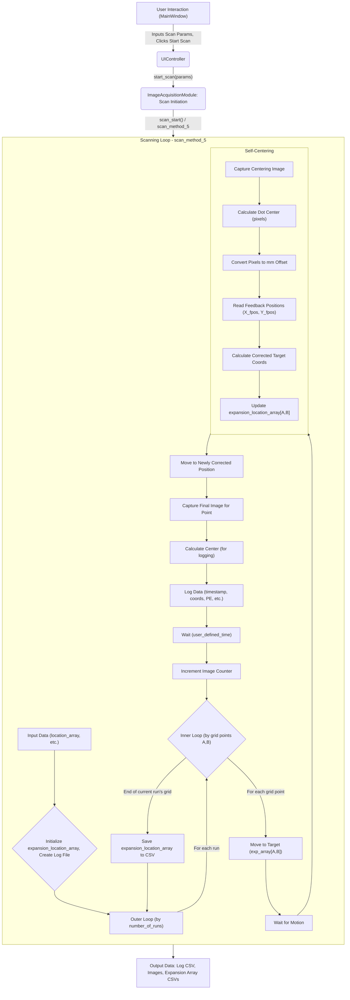
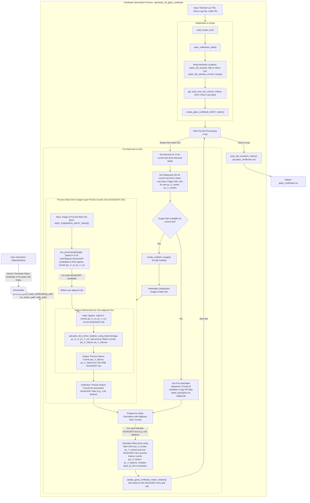

# Data Flows

This document outlines the high-level data flows for key features and operations within the PBA Vision Mapping system.

## 1. FEAT-001: Automated Grid Scanning and Image Acquisition (e.g., using `scan_method_5`)

1.  **User Interaction (`MainWindow`)**:
    *   User inputs parameters: `first_target`, `last_target`, `num_runs`, `num_images`, `wait_time`, `axis_select`, etc. on the UI.
    *   User clicks "Start Scan" button.

2.  **Request to Controller (`UIController`)**:
    *   `MainWindow` calls `UIController.start_scan(params)`.

3.  **Scan Initiation (`ImageAcquisitionModule`)**:
    *   `UIController` calls `ImageAcquisitionModule.start_scan_in_thread()` or directly `scan_start()`.
    *   `scan_start()` initializes scan parameters, creates a parent directory for results.
    *   A specific scan method (e.g., `scan_method_5`) is invoked.

4.  **Scanning Loop (`ImageAcquisitionModule` - `scan_method_5`)**:
    *   **Input Data**: `location_array` (initial grid points from `CalibrationDataController`), `axis_select` (selected X,Y,Z axes indices), `camera_input` (camera object), `parent_directory` (for saving files), `hc` (Halcon/motor controller handle), UI parameters (`first_target_X/Y`, `last_target_X/Y`, `number_of_runs`, `wait_time`).
    *   An `expantion_location_array` is initialized, likely from `location_array`, to store corrected coordinates.
    *   A log file (e.g., `Log_file_2D_expansion_X_axis.csv`) is created using `create_log_file()`.
    *   Outer loop for `number_of_runs`.
    *   Inner loops iterate from `first_target_Y` to `last_target_Y` (rows, `A`) and `first_target_X` to `last_target_X` (columns, `B`), and then back if bidirectional scan is implied.
        *   `move_to_location(A,B,self.expantion_location_array)`: Sends commands to `backend.motor_control.acs_python_modules.motor_activation` to move axes to current corrected target.
        *   Waits for motion completion.
        *   **Self-Centering (`estimate_dot_center_button_clicked(A,B,count)`)**:
            *   Captures a centering image (`self.capture_image.save_frame()`). File saved to `parent_directory` (e.g., `centerring_image.png`).
            *   Image path passed to `self.pe_calculation.calculate_center()` (instance of `position_error_claculation` from `calculation_using_halcon.py`).
            *   `calculate_center()` returns dot center in pixels (pix_Y, pix_X, pix_R).
            *   Pixel offsets are converted to mm using recipe values (`image_center_pixel_x/y`, `pixel_to_mm`).
            *   Current feedback positions (X_fpos, Y_fpos) are read from UI labels (which are updated by motor controller feedback).
            *   Corrected target coordinates (`correction_value_x`, `correction_value_y`) are calculated.
            *   `self.expantion_location_array[0,A,B]` and `self.expantion_location_array[1,A,B]` are updated with these corrected values.
        *   `move_to_location(A,B,self.expantion_location_array)`: Moves to the newly corrected position.
        *   `image_capture(count)`:
            *   Captures and saves the final image for this point (e.g., `{count}.png`).
            *   Calls `self.pe_calculation.calculate_center()` on this new image; results stored in `self.calculated_values`.
        *   `log_write(log_file_path,A,B)`:
            *   Gathers data: timestamp, run number, image name (`{count}.png`), target indices (A,B), commanded positions from `expantion_location_array`, axis position errors (PE_X, PE_Y, PE_Z from `get_PE()`), pixel values from `self.calculated_values`, temperature readings from `read_temparature.read_temparature()`.
            *   Appends this data as a new row to the log CSV file.
        *   `time.sleep(self.wait_time)`.
        *   Image counter `count` is incremented.
    *   After each run, `save_expansion_array(array_file_name)`: Saves the current state of `self.expantion_location_array` to a CSV file (e.g., `Expansion_array_2D_{self.run}.csv`).
    *   Progress/status updates can be relayed back to `UIController` -> `MainWindow` (though not explicitly detailed in `scan_and_capture.py` code for `scan_method_5`).

5.  **Output Data**:
    *   Log file: e.g., `Log_file_2D_expansion_X_axis.csv` (contains detailed per-point data).
    *   Captured images: e.g., `0.png`, `1.png`, ..., `centerring_image.png` (stored in `parent_directory`).
    *   Expansion array file(s): e.g., `Expansion_array_2D_0.csv`, `Expansion_array_2D_1.csv` (contains the final centered X,Y encoder coordinates for each grid point for each run).

## 2. FEAT-002: Generate Glass Scale Certificate

1.  **User Interaction (`MainWindow`)**:
    *   User selects "Generate Glass Scale Certificate" action.
    *   User provides paths to:
        *   Vision Log File (e.g., `Log_file_2D_expansion_X_axis.csv`)
        *   Location Matrix File (e.g., `calculated_all_referance_locations.csv`)
        *   Camera Calibration File (e.g., `camera_calibration_data.npz`)
    *   User clicks "Run Action".

2.  **Request to Controller (`UIController`)**:
    *   `MainWindow` calls `UIController.generate_glass_scale_certificate(log_file_path, location_matrix_file_path, camera_calibration_file_path)`.

3.  **Certificate Generation (`GlassCertificateGenerationModule`)**:
    *   `UIController` calls `GlassCertificateGenerationModule.generate_2d_glass_certificate()`.
    *   **Input Data**:
        *   Reads `location_matrix_file_path` (nominal dot positions).
        *   Reads `vision_log_file_file_path` (actual measured dot positions from a scan).
        *   Reads `camara_calibration_file_path` (camera correction parameters).
    *   The module processes these files:
        *   Aligns nominal data with measured data.
        *   Applies camera calibration corrections to vision data if necessary.
        *   Calculates differences (errors) between nominal and (corrected) measured positions.
    *   **Output Data**: Writes the results to `glass_certificate_2D_relative.csv`.

## 3. FEAT-003: Generate Encoder Error Matrix

1.  **User Interaction (`MainWindow`)**:
    *   User selects "Generate Encoder Error Matrix" action.
    *   User provides path to Vision Log File (e.g., `Log_file_2D_expansion_X_axis.csv`). The system infers paths to other required files (`calculated_all_referance_locations.csv`, `glass_certificate_2D_relative.csv`, `Expansion_array_2D_0.csv`) based on the directory of this log file.
    *   User clicks "Run Action".

2.  **Request to Controller (`UIController`)**:
    *   `MainWindow` calls `UIController.generate_encoder_error_matrix(vision_log_file_file_path)`.

3.  **Error Matrix Generation (`EncoderErrorMatrixModule`)**:
    *   `UIController` calls `EncoderErrorMatrixModule.generate_2D_encoder_error_matrix()` (or the main script execution block which calls methods on an instance of `encoder_error_matrix`).
    *   **Input Data** (paths derived from `vision_log_file_file_path`'s directory):
        *   `vision_log_file_file_path`: Used to determine `stop_condition_i` and `stop_condition_j` (max rows/columns for the grid).
        *   `location_matrix_file_path` (e.g., `calculated_all_referance_locations.csv`): Nominal/reference dot locations.
        *   `glass_certificate_matrix_file_path` (e.g., `glass_certificate_2D_relative.csv`): Calibrated dot locations from the glass standard.
        *   `dot_center_encoder_location_matrix_file_path` (e.g., `Expansion_array_2D_0.csv`): Actual encoder positions recorded when the system was centered on each dot.
    *   The module performs the following conceptual steps (based on the script's test code and class methods):
        a.  Reads the vision log to determine grid dimensions (`stop_condition_i`, `stop_condition_j`).
        b.  Loads the location matrix, glass certificate, and expansion array (encoder positions) using `open_3D_location_file()` or `open_file_pandas_convert_numpy()`.
        c.  Initializes various matrices: `encoder_error_matrix`, `vision_cumilative_distance_matrix`, `encoder_distance_matrix` using `create_error_matrix()`.
        d.  (Placeholder logic for `get_index_zero_to_dot_distance` and populating `vision_cumilative_distance_matrix` and `encoder_distance_matrix` - this part seems incomplete in the provided script but would involve calculating cumulative distances from the glass certificate and encoder readings).
        e.  Saves the `vision_cumilative_distance_matrix` using `save_3d_matrix()`.
        f.  Calculates a `vision_rotational_matrix` by calling `get_camera_rotation_matrix(self.vision_cumilative_distance_matrix)` to correct for camera angle.
        g.  (The direct calculation of the `encoder_error_matrix` by comparing a corrected vision matrix with an encoder position matrix is not fully detailed in the script's `generate_2D_encoder_error_matrix` method, but the principle is to find the difference between where the encoder *is* and where the vision system (corrected) says the dot *is*).
        h.  The final error matrix (conceptually `encoder_error_matrix`) would then be used.
    *   **Output Data**:
        *   Saves `vision_cumilative_distance_matrix.csv`.
        *   (Implicitly, the `encoder_error_matrix` would be populated and could be saved as `x_error_map_2D.csv` and `y_error_map_2D.csv`, though the script's main method for this is a placeholder).
    *   Optionally, `generate_ACS_errormaps(encoder_error_matrix)` can be called to convert the `encoder_error_matrix` into a format for the ACS controller and save it.

## 4. Data Flow for Plotting (e.g., Error Map Plot)

1.  **User Interaction (`MainWindow`)**:
    *   User selects an action that involves plotting (e.g., "Plot Error Map" if such an action exists, or implicitly after generating an error map).
    *   User provides path to the relevant data file (e.g., `Log_file_2D_error_map.csv`).

2.  **Request to Controller (`UIController`)**:
    *   `MainWindow` calls a method on `UIController` (e.g., `UIController.plot_error_map(file_path)`).

3.  **Plot Generation (`ErrorMapPlottingModule`)**:
    *   `UIController` calls `ErrorMapPlottingModule.generate_2D_error_map_plot(Log_file_2D_error_map_test_file_path)`.
    *   **Input Data**: Reads the specified log/data file (e.g., `Log_file_2D_error_map.csv`).
    *   The module processes the data and uses Matplotlib to generate plots.
    *   **Output**: A Matplotlib figure object.

4.  **Display (`MainWindow`)**:
    *   The Matplotlib figure is passed back from `ErrorMapPlottingModule` -> `UIController` -> `MainWindow`.
    *   `MainWindow` displays the figure in the UI.

---

*Related Links:*
*   [Detailed Component Designs](./component_designs.md)
*   [API Specifications](./api_specifications.md)
*   [Data Models](./data_models.md)
*   [Key Algorithms](./key_algorithms.md)
*   [Main README](../../README.md)
