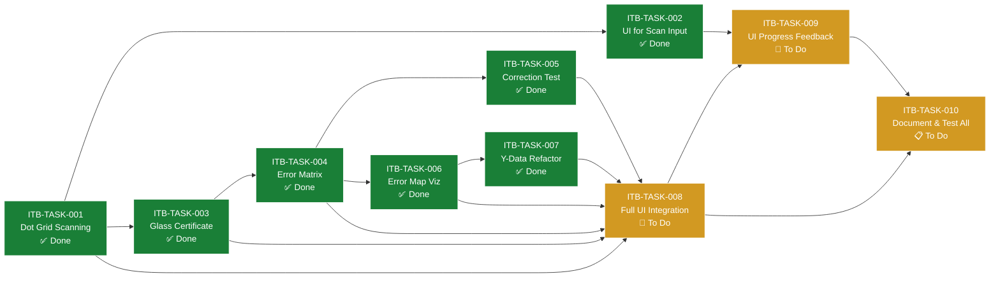

# Task Dependency Map: PBA Vision Mapping

## Visual Dependency Graph

## Dependency List

- ITB-TASK-002 depends on ITB-TASK-001
- ITB-TASK-003 depends on ITB-TASK-001
- ITB-TASK-004 depends on ITB-TASK-003
- ITB-TASK-005 depends on ITB-TASK-004
- ITB-TASK-006 depends on ITB-TASK-004
- ITB-TASK-007 depends on ITB-TASK-006
- ITB-TASK-008 depends on ITB-TASK-001, ITB-TASK-003, ITB-TASK-004, ITB-TASK-005, ITB-TASK-006, ITB-TASK-007
- ITB-TASK-009 depends on ITB-TASK-002, ITB-TASK-008
- ITB-TASK-010 depends on all previous tasks

*See `task_backlog.md` for task details.*

---

## Related Links

- [Implementation Plan](./implementation_plan.md)
- [Task Backlog](./task_backlog.md)
- [Main Project README](../../README.md)
