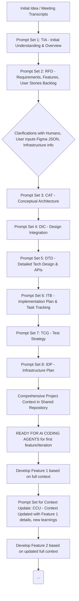

# AI Agent-Driven Context Generation Process for Software Development
**Version: 1.2** (Consolidated and Reviewed)

## 1. Overview
This document outlines a multi-agent, prompt-driven process designed to systematically develop a comprehensive project context for new software development initiatives. The core idea is to utilize a series of specialized AI agents, guided by specific prompt instructions, to transform initial project discussions (e.g., meeting transcripts) into a rich, actionable "Shared Project Context Repository." This repository enables subsequent AI agents (e.g., coding agents) to efficiently and accurately develop the codebase, documentation, and other project deliverables. The process aims to generate a full set of documentation, including requirements, architecture, design specifications, and a complete implementation plan, before coding commences.

## 2. Core Concept: The Shared Project Context Repository
At the heart of this process is a **Shared Project Context Repository**. This is a dynamic, evolving knowledge base that:

*   Serves as the single source of truth for all project-related information.
*   Is continuously updated and enriched by each AI agent in the process, guided by specific prompts.
*   Stores all artifacts: meeting summaries, requirements (backlog), feature lists, user stories, architectural diagrams, API specifications, design integrations, implementation plans, and infrastructure details.
*   Provides the necessary, evolving input for subsequent agents and for each feature's development cycle.

## 3. Agent-Based Context Generation Phases & Agents
The process is structured into logical phases, with each agent performing a specialized role triggered by specific prompt sets.

### Phase 1: Foundation & Understanding
This phase focuses on translating raw ideas from meetings into a structured understanding of the project's purpose, scope, and initial requirements.

#### 1. Transcript Ingestion & Initial Understanding Agent (TIA)

*   **Purpose:** To parse initial inputs (meeting transcripts), extract core ideas, generate a project overview, and identify ambiguities to establish a foundational understanding.
*   **Prompt Guidance:** Instructed to summarize discussions, identify problems, goals, and stakeholders.
*   **Input (from User/System):**
    *   Raw meeting transcript.
*   **Core Task(s):**
    *   Parse transcript.
    *   Summarize discussions.
    *   Identify high-level elements (problems, goals, stakeholders, raw user needs).
    *   Formulate clarifying questions about the transcript's content.
*   **Output (to Shared Project Context Repository):**
    *   Structured Meeting Notes/Summary.
    *   Initial Project Overview.
    *   Preliminary Problem Statement.
    *   List of High-Level Goals and Business Objectives.
    *   Identified Stakeholders.
    *   List of Raw User Needs/Pain Points (as directly mentioned or strongly implied).
    *   Clarifying Questions (for humans, to solidify the above).

#### 2. Requirements Elicitation & Feature Definition Agent (RFD)

*   **Purpose:** To translate high-level goals, meeting outputs, and initial user needs into a detailed requirement list (backlog), feature list, user stories, and preliminary NFRs.
*   **Prompt Guidance:** Instructed to convert meeting outcomes into a backlog, generate features, and draft user stories/use cases.
*   **Input (from Shared Project Context Repository):**
    *   Output from TIA (Structured Meeting Notes/Summary, Initial Project Overview, Preliminary Problem Statement, List of High-Level Goals and Business Objectives, Identified Stakeholders, List of Raw User Needs/Pain Points).
    *   Human answers to TIA's clarifying questions.
*   **Input (from User/System - if available):**
    *   Any existing user research or market analysis.
*   **Core Task(s):**
    *   Translate foundational understanding into formal requirements.
    *   Define project features with descriptions and acceptance criteria.
    *   Draft user stories in industry-standard format with acceptance criteria.
    *   Identify preliminary Non-Functional Requirements (NFRs).
*   **Output (to Shared Project Context Repository):**
    *   Detailed requirement list (project backlog).
    *   Structured list of project Features with descriptions and acceptance criteria.
    *   User Stories in industry-standard format with acceptance criteria.
    *   Preliminary list of Non-Functional Requirements (NFRs).
    *   Clarifying Questions (for humans, if needed for these specific outputs).

### Phase 2: Design & Architecture
This phase focuses on defining the technical and user experience blueprint, integrating user-provided designs, and establishing the system architecture.

#### 3. Conceptual Architecture & Technology Stack Advisor Agent (CAT)

*   **Purpose:** To propose high-level system architecture and technology choices based on requirements, user input on infrastructure, and defined NFRs.
*   **Prompt Guidance:** Instructed to generate architecture options considering requirements, meeting notes, and infrastructure constraints provided by the user.
*   **Input (from Shared Project Context Repository):**
    *   List of High-Level Goals and Business Objectives (from TIA).
    *   Structured list of project Features with descriptions and acceptance criteria (from RFD).
    *   User Stories in industry-standard format with acceptance criteria (from RFD).
    *   Preliminary list of Non-Functional Requirements (NFRs) (from RFD).
    *   Structured Meeting Notes/Summary (from TIA - for any subtle context or constraints mentioned).
*   **Input (from User - direct or via initial setup):**
    *   User input on target infrastructure preferences/constraints (e.g., "AWS only," "on-premise," specific cloud services preferred).
    *   Team skill sets or technology preferences (optional, if available).
*   **Core Task(s):**
    *   Propose high-level system architecture.
    *   Suggest technology stacks with rationale.
    *   Identify major system components and their interactions (e.g., C4 Model Level 1 & 2 context).
    *   Document key architectural decisions and trade-offs.
*   **Output (to Shared Project Context Repository):**
    *   Proposed conceptual architecture diagrams (textual descriptions or references to generated visual formats if supported).
    *   Technology stack recommendations with rationale (languages, frameworks, databases, key libraries/services).
    *   List of major system components and their high-level interactions.
    *   Key architectural decisions and trade-offs considered.
    *   Clarifying Questions (for humans, if architectural choices have significant trade-offs requiring human decision).

#### 4. Design Integration & Contextualization Agent (DIC)

*   **Purpose:** To process and integrate user-provided design artifacts (e.g., Figma JSON) into the project context, outlining UI flows, components, and mapping them to features/stories.
*   **Prompt Guidance:** Instructed to parse design files, extract UI elements, map them to features/user stories, and define user flows.
*   **Input (from Shared Project Context Repository):**
    *   Structured list of project Features with descriptions (from RFD).
    *   User Stories in industry-standard format (from RFD).
*   **Input (from User - direct):**
    *   One or more design files (e.g., Figma design file in JSON export format, other structured wireframe data like "JPA wireframe as JSON").
*   **Core Task(s):**
    *   Parse design files.
    *   Identify UI components and user flows from designs.
    *   Map UI elements/flows to features and user stories.
    *   Outline UI-driven integration points.
*   **Output (to Shared Project Context Repository):**
    *   Integrated User Flow Descriptions (text-based representation of screen sequences and interactions from designs).
    *   Catalogue of UI Components derived from designs (name, description, key characteristics/variants, source screens).
    *   Mappings between UI Elements/Flows and Features/User Stories.
    *   High-level descriptions of UI-driven integration points (conceptual interactions with backend/services).
    *   Clarifying Questions (for humans, if designs are ambiguous or conflict with existing features/stories).

#### 5. Detailed Technical Design & Data Model Agent (DTD)

*   **Purpose:** To elaborate on the technical blueprint, defining API specifications, data models, detailed component interactions, and key algorithms based on the established architecture and design context.
*   **Prompt Guidance:** Instructed to define API contracts, database schemas, and detailed component behaviors based on architecture and features.
*   **Input (from Shared Project Context Repository):**
    *   Proposed conceptual architecture (from CAT).
    *   Technology stack recommendations (from CAT).
    *   List of major system components (from CAT).
    *   Structured list of project Features with descriptions and acceptance criteria (from RFD).
    *   User Stories in industry-standard format with acceptance criteria (from RFD).
    *   Preliminary list of Non-Functional Requirements (NFRs) (from RFD).
    *   Integrated User Flow Descriptions (from DIC).
    *   Catalogue of UI Components (from DIC).
    *   Mappings between UI Elements/Flows and Features/User Stories (from DIC).
    *   High-level descriptions of UI-driven integration points (from DIC).
*   **Core Task(s):**
    *   Refine conceptual architecture into detailed component designs (responsibilities, interfaces, logic outlines).
    *   Define API contracts (e.g., OpenAPI/Swagger, gRPC protos).
    *   Design data models/schemas (tables, fields, relationships).
    *   Specify data flows between components and storage.
    *   Identify and describe key algorithms or complex logic modules.
*   **Output (to Shared Project Context Repository):**
    *   Detailed component designs (responsibilities, key interfaces, internal logic outline for each major component).
    *   API specifications (e.g., OpenAPI/Swagger format for REST APIs, gRPC proto definitions, or similar for other protocols; including endpoints, request/response schemas, authentication methods).
    *   Database schema diagrams (or structured definitions of data models, tables, fields, relationships, constraints).
    *   Data flow diagrams (illustrating how data moves between components and storage).
    *   Identification of key algorithms or complex logic modules (with pseudocode or detailed descriptions).
    *   Clarifying Questions (for humans, if technical design decisions require input on specific trade-offs or unresolved details).

### Phase 3: Planning & Preparation for Development
This phase focuses on creating a concrete implementation plan, including task breakdown, test strategies, and infrastructure planning.

#### 6. Implementation & Task Breakdown Agent (ITB)

*   **Purpose:** To break down the project features, user stories, and technical designs into manageable development tasks, create a detailed implementation plan, and define tracking mechanisms.
*   **Prompt Guidance:** Instructed to generate a feature list with task tracking, define the "function list" (to-do items), establish the implementation plan including current pace/status.
*   **Input (from Shared Project Context Repository):**
    *   Detailed component designs (from DTD).
    *   API specifications (from DTD).
    *   Database schema diagrams/data models (from DTD).
    *   Structured list of project Features with descriptions and acceptance criteria (from RFD).
    *   User Stories in industry-standard format with acceptance criteria (from RFD).
*   **Core Task(s):**
    *   Decompose features, user stories, and technical designs into smaller, implementable development tasks.
    *   Create a prioritized backlog of these tasks.
    *   Develop an initial implementation plan (e.g., phases, sprints).
    *   Define dependencies between tasks.
    *   Propose a structure for tracking task progress.
*   **Output (to Shared Project Context Repository):**
    *   Detailed implementation plan (execution plan, potentially including phases or sprints).
    *   Prioritized backlog of development tasks (e.g., "function list" / to-do items, each with a clear description, estimated effort/complexity if possible, and links to parent features/stories/components).
    *   Dependency map between tasks.
    *   Proposed structure/fields for tracking task progress, current status, and pace (if not using an external tool whose schema can be adopted).

#### 7. Test Strategy & Case Generation Agent (TCG)

*   **Purpose:** To define how the system will be validated by outlining a comprehensive test strategy and generating initial test scenarios and cases.
*   **Prompt Guidance:** Instructed to outline test approaches and generate test scenarios based on requirements and design.
*   **Input (from Shared Project Context Repository):**
    *   Structured list of project Features with descriptions and acceptance criteria (from RFD).
    *   User Stories in industry-standard format with acceptance criteria (from RFD).
    *   Preliminary list of Non-Functional Requirements (NFRs) (from RFD).
    *   Detailed component designs (from DTD).
    *   API specifications (from DTD).
    *   Integrated User Flow Descriptions (from DIC).
*   **Core Task(s):**
    *   Define an overall testing strategy (levels, types, environments).
    *   Generate high-level test scenarios from features, user stories, and user flows.
    *   Outline initial test cases for critical functionalities, APIs, and NFRs.
*   **Output (to Shared Project Context Repository):**
    *   Overall test strategy document (covering levels: unit, integration, system/E2E, performance, security, usability; types of testing; environments).
    *   List of high-level test scenarios (derived from features, user stories, and user flows).
    *   Outline of test cases for critical functionalities, API endpoints, and NFRs (including pre-conditions, steps, expected results).

#### 8. Infrastructure & Deployment Planning Agent (IDP)

*   **Purpose:** To define the necessary infrastructure, propose a deployment strategy, and outline "Infrastructure as Code" (IaC) components based on user input and architectural decisions.
*   **Prompt Guidance:** Instructed to detail infrastructure needs and deployment steps based on architecture and user-specified hosting environment.
*   **Input (from Shared Project Context Repository):**
    *   Proposed conceptual architecture (from CAT).
    *   Technology stack recommendations (from CAT).
    *   Preliminary list of Non-Functional Requirements (NFRs) (especially scalability, availability, performance, security) (from RFD).
    *   User input on target infrastructure preferences/constraints (from CAT's inputs).
    *   Detailed component designs (from DTD - for specific resource needs).
*   **Core Task(s):**
    *   Define infrastructure requirements (compute, storage, networking, etc.).
    *   Propose a deployment strategy (CI/CD, environments, rollout計画). <!-- Japanese term "rollout計画" (rollout plan) retained from source text. Consider standardizing to English. -->
    *   Outline conceptual "Infrastructure as Code" (IaC) components.
*   **Output (to Shared Project Context Repository):**
    *   Infrastructure requirements document (compute, storage, networking, databases, messaging queues, security services, etc.).
    *   Deployment strategy outline (CI/CD pipeline stages, environments: dev, staging, prod; rollout strategy).
    *   Conceptual "Infrastructure as Code" (IaC) plan (e.g., list of resources to be managed by Terraform/CloudFormation, key configuration parameters).

### Overarching & Iterative Agent

#### 9. Context Cohesion & Update Agent (CCU) - "Context Guardian & Synchronizer"
*   **Purpose:** To ensure the integrity, consistency, traceability, and accuracy of the Shared Project Context Repository (SPCR) throughout the project lifecycle. This involves two primary functions:
    *   **Proactive Validation:** Validating proposed context additions and modifications from other agents before development to ensure coherence and quality from the outset.
    *   **Post-Implementation Synchronization:** Updating the SPCR documentation (e.g., DTD, ITB) to accurately reflect the "as-built" state of the software after features are implemented, by analyzing the codebase and reconciling it with planned artifacts.
*   **Prompt Guidance / Activation Logic:**
    *   **For Proactive Validation Mode:** Instructed/triggered to validate new or modified context artifacts (from TIA, RFD, CAT, DIC, DTD, ITB, TCG, IDP) against existing information, flagging discrepancies and ambiguities before they propagate.
    *   **For Post-Implementation Synchronization Mode:** Instructed/triggered after a feature or set of tasks is reported as implemented, to analyze the corresponding codebase, compare it to the "as-planned" documentation (especially DTD and ITB), and update the SPCR to reflect the "as-built" reality.
*   **Input:**
    *   **Mode 1 (Proactive Validation):**
        *   Notifications of additions/modifications to SPCR artifacts by other agents.
        *   Full read-access to the current SPCR.
        *   (Optional) Pre-defined validation rules and schemas.
    *   **Mode 2 (Post-Implementation Synchronization):**
        *   Notification of feature/task implementation completion (including relevant Feature/Task IDs).
        *   Access to the implemented codebase snapshot/changeset.
        *   Relevant "as-planned" DTD and ITB documents from the SPCR.
*   **Core Task(s):**
    *   **General (Applies to both modes):**
        *   Maintain overall integrity, consistency, and traceability within the SPCR.
        *   Manage or suggest links for traceability between context elements and between planned vs. implemented states.
        *   Facilitate versioning or contribute to changelogs for the SPCR.
        *   Log discrepancies and their resolutions.
    *   **Mode 1 Specific (Proactive Validation):**
        *   Validate new/updated context additions against existing information for contradictions, inconsistencies, and ambiguities.
        *   Flag discrepancies for human review before development proceeds based on potentially flawed context.
    *   **Mode 2 Specific (Post-Implementation Synchronization):**
        *   Correlate implemented code with planned tasks (ITB).
        *   Analyze code to identify "as-built" technical artifacts (APIs, DB changes, etc.).
        *   Compare "as-built" state with "as-planned" (DTD) documentation.
        *   Update DTD, ITB, and potentially other SPCR documents to accurately reflect the implemented reality.
        *   Document significant deviations from the plan.
*   **Output:**
    *   **Shared Outputs (Potentially from both modes):**
        *   **Discrepancy Log:** A persistent record of all identified issues (validation errors, significant implementation deviations).
        *   Prompts for Human Review and Validation: For resolving ambiguities, confirming decisions, or reviewing significant deviations.
        *   Suggestions for Improving Traceability & Context.
        *   Contributions to SPCR Changelog / Versioning Information.
    *   **Mode 1 Specific Outputs (Proactive Validation):**
        *   (If critical) Validation Alerts: For immediate attention to issues in proposed context.
    *   **Mode 2 Specific Outputs (Post-Implementation Synchronization):**
        *   Updated DTD Artifacts (As-Built Version): Reflecting actual implementation.
        *   Updated ITB Document (Task Statuses & As-Built Annotations).
        *   Feature Implementation Synchronization Report: Summarizing changes and deviations.

## 4. Process Flow & Iteration

Each feature implementation may go through a mini-cycle of context refinement and update, ensuring the Shared Project Context Repository remains current and accurate.

## 5. Benefits

This prompt-driven, agent-based process aims to:

* Build Comprehensive Context: Each agent contributes to a rich, multi-faceted understanding of the project. Systematically generates all necessary documentation and understanding.
* Enable AI-Driven Development: Provides the necessary foundation for AI agents to perform complex tasks like code generation.
* Facilitate Iteration: Supports updating context as each feature is developed.
* Improve Traceability & Consistency: Decisions and artifacts are documented and linked within the shared context, aided by the CCU.
* Enhance Efficiency: Automates many of the laborious context-gathering and documentation tasks.
* Elevate Human Roles: Allows human experts to focus on strategic decisions, clarifications, and validation rather than rote tasks.
* Iterative Refinement: While presented sequentially, the process can incorporate feedback loops where insights from later stages * inform earlier ones, with the CCU helping manage changes.

## 6. Ultimate Goal

The output of this entire process is a meticulously constructed Shared Project Context Repository. This repository will contain all the necessary information—from business goals to detailed technical specifications and implementation plans—to empower AI agents to begin writing code, generating documentation, creating infrastructure configurations, and performing other development tasks with a high degree of accuracy and alignment with the project's objectives.